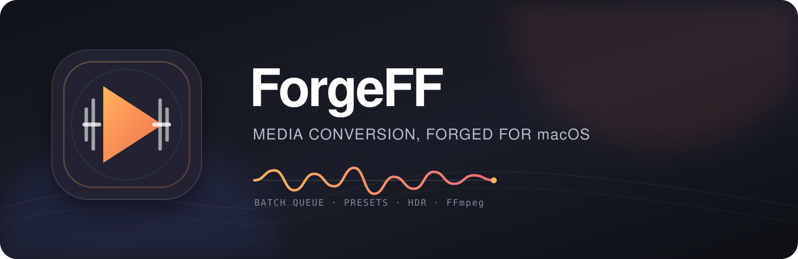

<p align="center">
  
</p>

<p align="center">
  <a href="https://github.com/yinon-mitin/ForgeFF/actions/workflows/macos-ci.yml"></a>
  <a href="https://github.com/yinon-mitin/ForgeFF/releases"></a>
  <a href="https://github.com/yinon-mitin/ForgeFF/blob/main/LICENSE"></a>
  
</p>

<p align="center"><strong>Simple and powerful batch media conversion for macOS.</strong><br>FFmpeg power without living in the terminal.</p>

## Introduction

ForgeFF is a native macOS batch media converter built around practical presets, a reliable queue, and the option to drop into detailed FFmpeg controls only when they are actually needed.

It is designed for people who want FFmpeg power without living in the terminal: drag files in, pick a preset, and convert. Advanced users still get codec, container, quality, subtitle, audio, cleanup, and custom-command controls when the job needs them.

## Demo

https://github.com/user-attachments/assets/de36a472-2231-4c34-a976-35b46f20f5e6

## Sidebar Screenshots

  

 

## Highlights

- Presets-first workflow for the common export paths: Telegram, Fast MP4, Efficient HEVC, VP9, AV1, and Editing ProRes.
- Live batch queue that accepts new files and folders while conversion is running, with start/pause/cancel/retry controls, per-job progress, and Dock progress.
- Clean default UI with compact presets and pinned Start/More Settings controls; detailed options scroll independently.
- Custom and user presets with consistent selection, customization, import, and export behavior.
- Multiple external audio tracks and multiple external subtitle files with ordered muxing support.
- Output folder controls for defaults, per-selection overrides, and folder drag-and-drop.
- HDR to SDR tone mapping with a selectable Apple VideoToolbox or FFmpeg backend when the Mac supports both paths.
- Preview thumbnails, Quick Look for completed outputs, and a dedicated right-side inspector for failure details.
- Native macOS presentation in dark mode with keyboard-reachable controls across the main workflow.

## Installation

ForgeFF requires:

- macOS 13 or newer
- FFmpeg and FFprobe available on the machine

ForgeFF is distributed as a non-sandboxed desktop application because it executes the machine's externally installed Homebrew FFmpeg/FFprobe binaries and their dynamic codec libraries. This is required for reliable Finder `Open With` imports and metadata analysis; the app does not bundle or upload media files.

ForgeFF does not bundle FFmpeg. The app auto-detects the standard Homebrew `bin` and `opt/ffmpeg/bin` locations on both Apple silicon and Intel Macs, and prompts for manual selection if it cannot find the binaries. The setup prompt can be closed if you only want to inspect the app, and it always allows quitting ForgeFF with `Command-Q`.

Install FFmpeg with Homebrew:

```bash
brew install ffmpeg
```

Download ForgeFF from GitHub Releases:

1. Download the latest `ForgeFF-X.Y.Z-macOS.zip` archive from the repository’s Releases page.
2. Unzip the archive and drag `ForgeFF.app` into `/Applications`.
3. Launch the app once. macOS may block the first launch because ForgeFF uses an ad-hoc, non-notarized signature.
4. Open `System Settings` → `Privacy & Security`, scroll to the security section, and click `Open Anyway` for ForgeFF.
5. Confirm the launch, then open ForgeFF normally. This approval is usually required only once per installed version.

## Usage

1. Drop a video, audio file, or folder into ForgeFF.
2. Choose a preset — `Telegram` is the easy default.
3. Press `Start`.

That is the normal workflow. Use `More Settings` only when you need to change audio, subtitles, resolution, HDR, or codec details.

### Terminal

ForgeFF also supports CLI arguments:

```bash
./script/forgeff convert input.mkv --preset telegram --output-dir ./out
```

To add files to the main ForgeFF queue:

```bash
./script/forgeff add input.mkv another.mp4
```

See the [complete CLI option index](docs/cli.md) for automation and advanced usage.

### Useful shortcuts

- `⌘/` — About ForgeFF
- `⌘,` — More Settings
- `⌃C` — pause the current conversion
- `⌘C` — copy the selected file
- `⌘V` — paste files into the queue
- `⌘X` — copy a completed output file

Drag external audio or subtitle files into their respective controls when needed. Detailed queue behavior, HDR conversion, troubleshooting, and development instructions are documented separately.

## Updates

ForgeFF checks the official `yinon-mitin/ForgeFF` GitHub Releases feed when it launches and can also be checked manually from `About ForgeFF`.

- Only published, non-prerelease releases with the exact expected ForgeFF asset names are considered.
- Before installation, the updater downloads the ZIP and its `.sha256` file, verifies the archive with SHA-256, and checks the bundle identifier and version.
- Installation is confirmed by the user. ForgeFF exits, replaces the existing app through a short-lived updater process, cleans its staging directory, and relaunches the new version.
- Checksums are published alongside every release archive. The updater never installs an unverified archive or a bundle from another application.
- If GitHub is unavailable, ForgeFF keeps working normally and shows a retry action instead of blocking startup.

## Documentation

- [Development Usage](docs/development.md) — local build, tests, packaging, and release workflow.
- [Repository Notes](docs/repository-notes.md) — maintainer notes, visual assets, and security boundary.

## License

ForgeFF is released under the MIT License. See [LICENSE](LICENSE).

### FFmpeg licensing

ForgeFF invokes user-installed FFmpeg and FFprobe. FFmpeg licensing remains separate from ForgeFF itself, so anyone redistributing FFmpeg binaries is responsible for complying with FFmpeg’s licensing terms.
